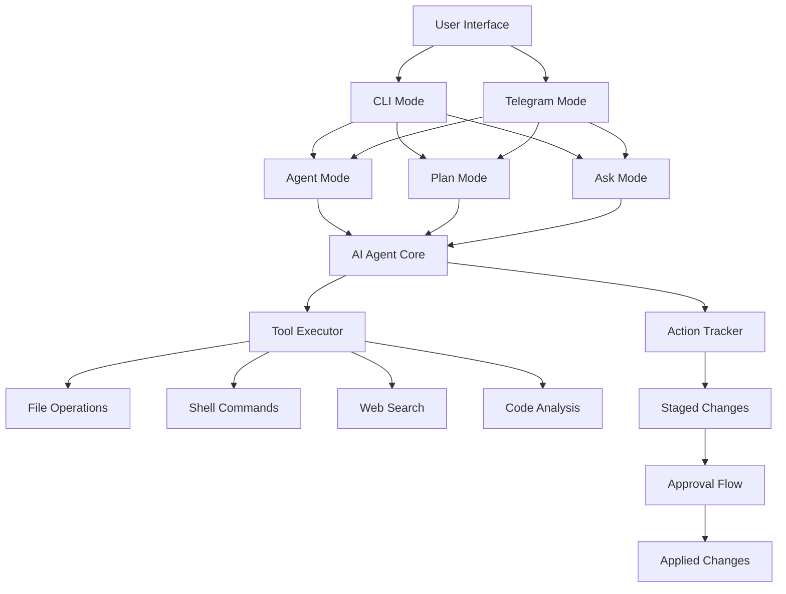

# ClawNest

A minimal open-source personal AI agent system inspired by OpenClaw, designed to assist with software development tasks through multiple interaction modes including CLI and Telegram.


## 🚀 Features

- **Multi-Modal Interaction**: CLI interface and Telegram bot support
- **Intelligent Agent Mode**: AI-powered code manipulation with safety approvals
- **Strategic Planning**: Break down complex goals into executable steps
- **Knowledge Querying**: Ask questions about your codebase
- **File System Operations**: Read, create, modify, delete files and folders
- **Code Analysis**: Search, analyze structure, understand dependencies
- **Shell Command Execution**: Run commands with staged approval
- **Web Integration**: Search and fetch information from the web
- **Approval Workflow**: All changes are staged until explicitly approved
- **Extensible Tool System**: Modular tool architecture for easy extension

## 🏗️ Architecture



## 📋 Modes Overview

| Mode | Description | Primary Use Case |
|------|-------------|------------------|
| **CLI Mode** | Interactive terminal interface | Local development, quick tasks |
| **Agent Mode** | Autonomous AI agent for code tasks | Refactoring, bug fixes, feature implementation |
| **Plan Mode** | Strategic planning and step execution | Complex project breakdowns |
| **Ask Mode** | Question-answering about codebase | Knowledge discovery, debugging |
| **Telegram Mode** | Remote access via Telegram bot | Mobile access, notifications, remote control |

## 🔧 Installation & Setup

### Prerequisites
- [Bun](https://bun.sh) (v1.0+)
- API keys for AI services:
  - [OpenRouter](https://openrouter.ai) (for AI models)
  - Optional: [Telegram Bot Token](https://core.telegram.org/bots#6-botfather) for Telegram mode
  - Optional: [Firecrawl](https://firecrawl.dev) for web search capabilities

### Installation Steps

1. **Clone the repository**
```bash
git clone <repository-url>
cd ClawNest
```

2. **Install dependencies**
```bash
bun install
```

3. **Configure environment variables**
Create a `.env` file in the root directory:
```env
# Required for AI functionality
OPENROUTER_API_KEY=your_openrouter_api_key_here
OPENROUTER_DEFAULT_MODEL=openrouter/free  # or specify a model like anthropic/claude-3-sonnet

# Required for Telegram mode (optional)
TELEGRAM_BOT_TOKEN=your_telegram_bot_token
TELEGRAM_OWNER_ID=your_telegram_user_id

# Optional for web search
FIRECRAWL_API_KEY=your_firecrawl_api_key
```

4. **Build (if needed)**
```bash
# Usually not needed as this uses Bun's direct execution
bun run build
```

## ▶️ Usage

### Starting the Application

```bash
# Run the main application (shows mode selection menu)
bun run index.ts

# Or directly start a specific mode
bun run index.ts wakeup  # Shows banner and mode selection
```

### CLI Mode Workflow

Upon starting, you'll see:
```
Select a mode
 › CLI
   Telegram
   Exit
```

Choose "CLI" to access:
```
Choose an option
 › Agent Mode
   Plan Mode
   ASK Mode
   Back
```

#### Agent Mode
1. Select "Agent Mode"
2. Enter your goal (e.g., "Create a login component in React")
3. Review the proposed changes
4. Approve or reject the staged modifications

#### Plan Mode
1. Select "Plan Mode"
2. Enter your high-level goal
3. Review the generated plan steps
4. Select which steps to execute
5. Approve and apply the changes

#### Ask Mode
1. Select "ASK Mode"
2. Enter your question about the codebase
3. Get an answer with citations to relevant files
4. Optionally save the answer to a markdown file

### Telegram Mode

To use ClawNest via Telegram:

1. Start the Telegram mode:
```bash
bun run index.ts wakeup
# Select "Telegram" option
```

2. Or run directly:
```bash
TELEGRAM_BOT_TOKEN=your_token TELEGRAM_OWNER_ID=your_id bun run src/modes/telegram/index.ts
```

3. In Telegram, send commands to your bot:
```
/ask What is the purpose of the auth.ts file?
/agent Create a utility function to validate email addresses
/plan Build a REST API for user management
```

## 📁 Project Structure

```
ClawNest/
├── index.ts                  # Entry point with commander.js
├── AI agent/                 # AI configuration and model setup
│   └── Ai.config.ts          # OpenRouter model provider
├── modes/                    # Different interaction modes
│   ├── CLI.ts                # Main CLI menu system
│   ├── agent/                # Autonomous agent functionality
│   │   ├── orchestrator.ts   # Main agent loop
│   │   ├── action-tracker.ts # Tracks pending changes
│   │   ├── tool-executor.ts  # Executes file/shell operations
│   │   ├── agent-tools.ts    # File system tools
│   │   ├── approval.ts       # Change approval workflow
│   │   ├── diff-view.ts      # Git-style diff generation
│   │   └── types.ts          # TypeScript interfaces
│   ├── plan/                 # Planning and strategic thinking
│   │   ├── orchestrator.ts   # Plan mode controller
│   │   ├── planner.ts        # Plan generation using AI
│   │   ├── selection.ts      # Step selection UI
│   │   ├── types.ts          # Plan-related types
│   │   └── web-tools.ts      # Web search and scraping
│   ├── ask/                  # Question answering
│   │   └── orchestrator.ts   # Ask mode implementation
│   └── telegram/             # Telegram bot integration
│       ├── index.ts          # Bot initialization
│       ├── handlers.ts       # Command handlers
│       ├── agent-run.ts      # Remote agent execution
│       ├── plan-session.ts   # Telegram plan management
│       ├── approval-session.ts # Telegram approvals
│       ├── auth.ts           # Owner validation
│       ├── constants.ts      # Welcome messages
│       └── text.ts           # Text utilities
├── tui/                      # Terminal UI utilities
│   ├── terminal-md.ts        # Markdown rendering in terminal
│   └── wakeup.ts             # Banner display and mode selection
├── todo-app/                 # Example todo application
│   └── PLAN-data-storage.md  # Storage plan documentation
├── todo-list-app/            # Simple todo list frontend
│   ├── index.html
│   ├── styles.css
│   └── script.js
├── package.json              # Dependencies and scripts
├── tsconfig.json             # TypeScript configuration
└── README.md                 # This file
```

## 🛠️ Available Commands

### Bun Scripts
```bash
# Install dependencies
bun install

# Start the application (interactive mode selector)
bun run index.ts

# Directly show banner and mode selection
bun run index.ts wakeup

# Run specific modes via CLI (when in CLI mode)
# These are accessed through the interactive menus
```

### Telegram Commands
Once Telegram mode is running:
```
/ask <question>        # Ask a question about the codebase
/agent <task>          # Give the agent a task to perform
/plan <goal>           # Generate and execute a plan for a goal
/start                 # Show welcome message
```

## 🔒 Safety Features

ClawNest includes several safety mechanisms:

1. **Staged Changes**: All file modifications are staged until approval
2. **Approval Workflow**: Review changes before applying (similar to git staging)
3. **Path Validation**: Prevents access outside the workspace
4. **File Size Limits**: Configurable limits on file reading
5. **Exclusion Patterns**: Automatic exclusion of sensitive files/directories
6. **Tool Permissions**: Configurable permissions for each tool category
7. **Telegram Owner Validation**: Only approved users can control the bot

## 🤖 AI Models

ClawNest uses OpenRouter to access various AI models. Configure your preferred model in the `.env` file:

```env
# Examples of different models you can use
OPENROUTER_DEFAULT_MODEL=anthropic/claude-3-sonnet
OPENROUTER_DEFAULT_MODEL=openai/gpt-4-turbo
OPENROUTER_DEFAULT_MODEL=google/gemini-pro-1.5
OPENROUTER_DEFAULT_MODEL=openrouter/free  # Uses free tier models
```

## 📝 Example Workflows

### Refactoring a Component
1. Start CLI mode → Agent Mode
2. Goal: "Refactor the user profile component to use hooks instead of class-based"
3. Review the AI-generated changes
4. Approve file modifications
5. Verify the changes work correctly

### Adding a New Feature
1. Start CLI mode → Plan Mode
2. Goal: "Implement dark mode toggle with localStorage persistence"
3. Review generated plan (create CSS variables, add toggle component, update state management)
4. Select steps to execute
5. Approve and apply changes
6. Test the new feature

### Debugging an Issue
1. Start Telegram mode
2. Send: `/ask Why is the authentication failing in the login flow?`
3. Get detailed answer with file references
4. If needed: `/agent Fix the authentication error in auth.ts`
5. Review and apply changes

## 🤝 Contributing

Contributions are welcome! Please feel free to submit a Pull Request.

1. Fork the repository
2. Create your feature branch (`git checkout -b feature/amazing-feature`)
3. Commit your changes (`git commit -m 'Add amazing feature'`)
4. Push to the branch (`git push origin feature/amazing-feature`)
5. Open a Pull Request

## 📄 License

This project is licensed under the MIT License - see the [LICENSE](LICENSE) file for details.

## 🙏 Acknowledgments

- Inspired by [OpenClaw](https://github.com/openclaw/openclaw)
- Built with [Bun](https://bun.sh)
- AI capabilities powered by [OpenRouter](https://openrouter.ai)
- Web search via [Firecrawl](https://firecrawl.dev)
- Terminal UI enhanced by [Clack](https://github.com/natemoore/clack)
- Telegram integration using [Telegraf](https://telegraf.js.org)

---

*ClawNest: Your personal AI agent for smarter software development*